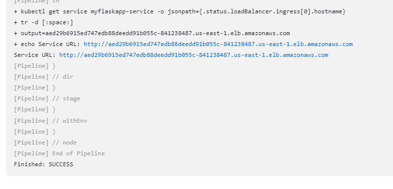
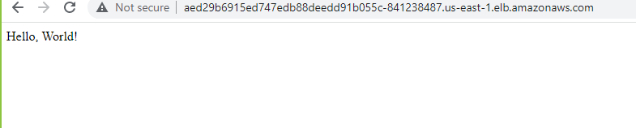

## Jenkins on k8s Project

The goal of this project is to build a Python-based application and deploy it to a k8s cluster using Jenkins. The application image is stored in a repository such as Amazon Elastic Container Registry (ECR), Nexus, or JFrog Artifactory.

## Prerequisites
- Jenkins installed on the build server with the following plugins:
  - Docker plugin
  - Kubernetes plugin
  - Git plugin
- kubectl and eksctl installed on the build server
- A k8s cluster with access to an image repository (ECR, Nexus, or Artifactory)

## Steps to set up the project
1. In Jenkins, install kubectl and eksctl on the build server.
You can find more information on how to install kubectl and eksctl on the following links:
- [Installing kubectl](https://kubernetes.io/docs/tasks/tools/install-kubectl/)
- [Installing eksctl](https://eksctl.io/introduction/installation/)

2. In Jenkins, create a new pipeline job and configure it to use the Jenkinsfile in the cloned repository.
3. Add the credentials for your image repository and k8s cluster in the Jenkins credentials store.
4. Trigger the pipeline to build the Docker image of the application and deploy it to your k8s cluster.

 
 

## Conclusion
This project demonstrates how to build and deploy a Dockerized Python application to a k8s cluster using Jenkins. By automating the deployment process, you can ensure that your applications are deployed consistently and quickly, reducing the risk of errors and increasing the efficiency of your DevOps workflow.
