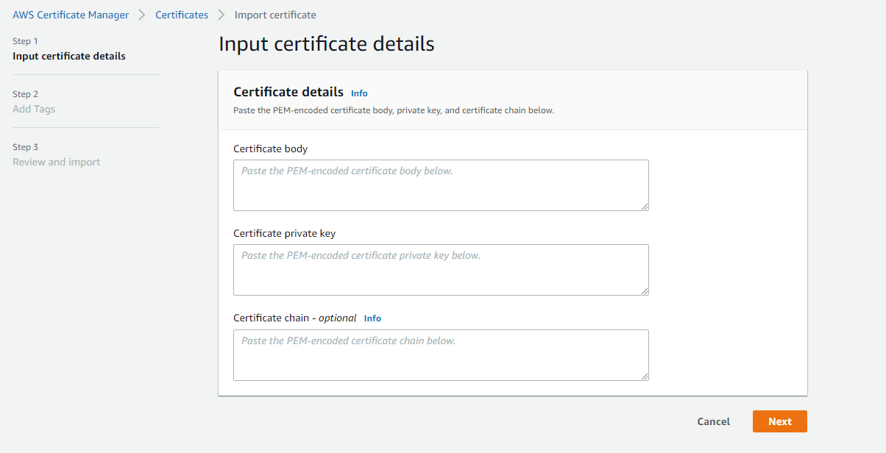

## Jenkins on k8s Project

The goal of this project is to build a Python-based application and deploy it to a k8s cluster using Jenkins. The application image is stored in a repository such as Amazon Elastic Container Registry (ECR).

## Prerequisites
- Jenkins installed on the build server with the following plugins:
  - Docker plugin
  - Kubernetes plugin
  - Git plugin
- kubectl and eksctl installed on the build server
- A k8s cluster with access to an image repository ECR

## Steps to set up the project
1. In Jenkins, install kubectl and eksctl on the build server.
You can find more information on how to install kubectl and eksctl on the following links:
- [Installing kubectl](https://kubernetes.io/docs/tasks/tools/install-kubectl/)
- [Installing eksctl](https://eksctl.io/introduction/installation/)

2. In Jenkins, create a new pipeline job and configure it to use the Jenkinsfile in the cloned repository.
3. Add the credentials for your image repository and k8s cluster in the Jenkins credentials store.
4. Trigger the pipeline to build the Docker image of the application and deploy it to your k8s cluster.

 
 


## Conclusion
This project demonstrates how to build and deploy a Dockerized Python application to a k8s cluster using Jenkins. By automating the deployment process, you can ensure that your applications are deployed consistently and quickly, reducing the risk of errors and increasing the efficiency of your DevOps workflow.


# SSL-TLS

It works on local machine but for a provider like AWS, known Certificate authority is needed to authorize your certifcate.

Create with ACM  - 
[Guide to use AWS Certificate Manager ACM](https://k21academy.com/amazon-web-services/aws-certificate-manager-acm/)

### Create localy -
 1. Need to generate certificate.
You can generate certificate using the following OpenSSL commands:

- `cd src`
- `mkdir cert && cd cert`
- `openssl genrsa -out key.pem 2048`
- `openssl req -new -sha256 -key key.pem -out csr.pem`
- `openssl x509 -req -in csr.pem -signkey key.pem -out cert.pem`

2. Change the `run` command at `main.py` -

``` app.run(host='0.0.0.0', port=5001, ssl_context=('cert/cert.pem', 'cert/key.pem')) ```


### Create at AWS:
1. To generate a certificate locally, follow the steps at the localy creation section.
2. Go to AWS ACM service and import your own certifcate.

fill the fileds `Certificate body` and `Certificate private key` with the `.pem` created before.
 


3. On the created certificate dashboard, you will find the ARN URL that needs to be added to the service.yml
4. Run the pipeline with all the necessary steps or apply the service.yml.


